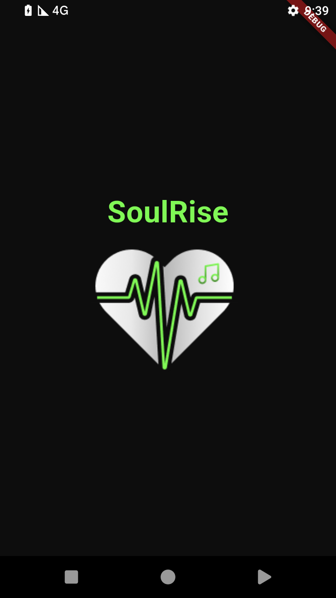
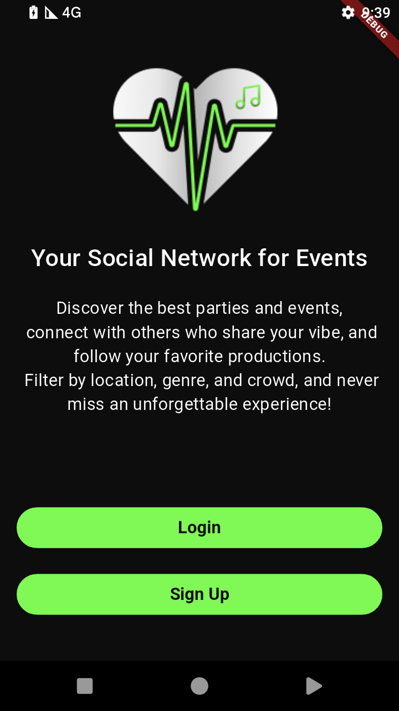
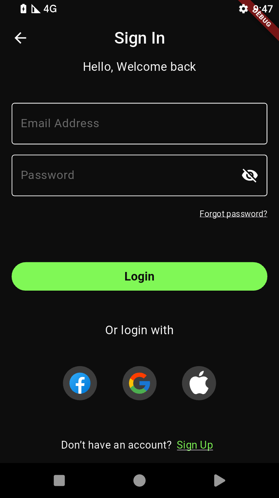
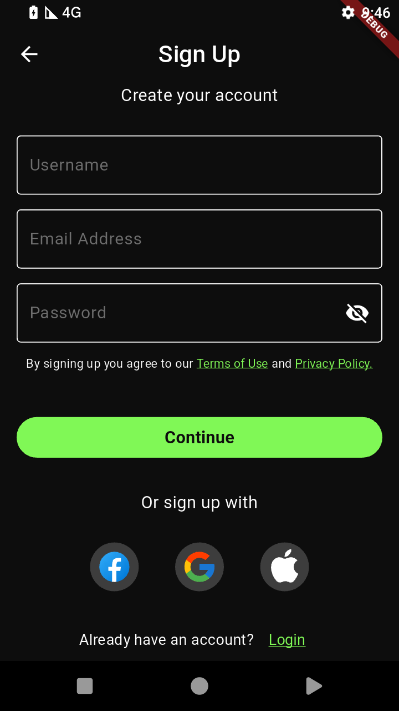
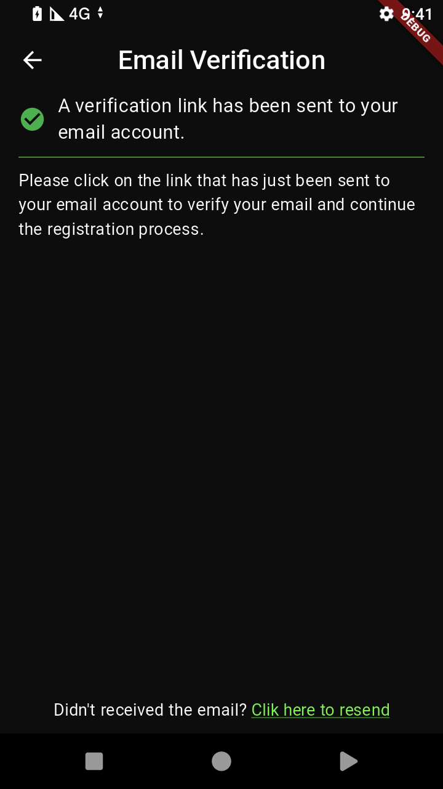
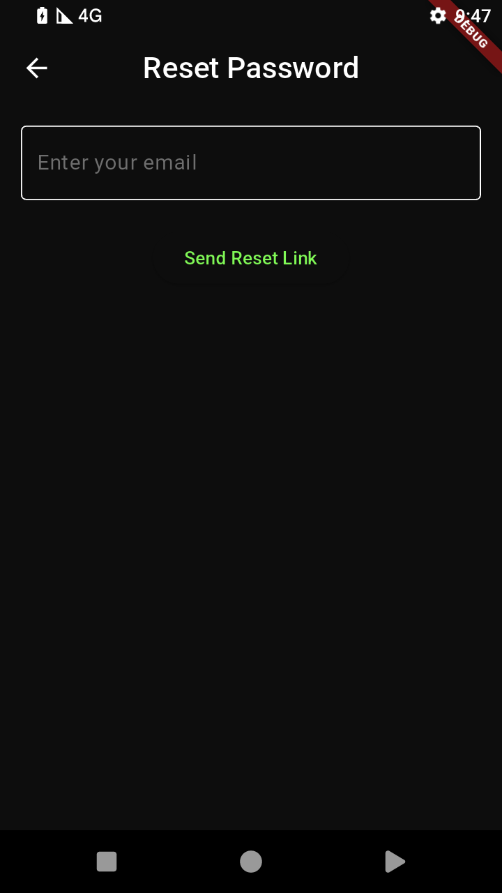

# Firebase Auth Template

[](https://opensource.org/licenses/MIT) [](https://flutter.dev)
[](https://flutter.dev) [](https://firebase.google.com/products/auth)
[](https://dart.dev/guides/language/effective-dart)

A secure and feature-rich user authentication system built with Flutter and Firebase. This project provides essential authentication flows like email/password sign-up (with email verification), password reset, and social logins (Google, Facebook). It leverages Clean Architecture principles and the Bloc pattern for a scalable, maintainable, and testable codebase.

---

## ✨ Features

- ✅ **Register with Email & Password**
  - Includes double password validation.
  - Sends an email verification link to the user's inbox.
- ✅ **Login with Email & Password**
- 🔐 **Forgot Password**
  - Sends a password reset link via email.
- 🔐 **Login with Google**
  - Fully implemented using Firebase Authentication.
- 🔐 **Login with Facebook**
  - Fully implemented using Firebase Authentication.
- 🕓 **Login with Apple**
  - UI is implemented, but the sign-in functionality is not yet connected.

---

## 🖼️ Screenshots

## 🖼️ Screenshots

| Splash / Register Screen           | Welcome / Verify Email Screen      | Login / Forgot Password Screen     |
| :--------------------------------: | :--------------------------------: | :--------------------------------: |
|  |  |  |
|  |  |  |

## 🛠️ Tech Stack

- **Framework:** Flutter (Cross-platform UI for Android & iOS)
- **Language:** Dart
- **Authentication Backend:** Firebase Authentication (Handles email/password, email verification, password reset, Google Sign-In, Facebook Login)
- **Architecture:** Clean Architecture (`presentation`, `domain`, `data` layers)
- **State Management:** Bloc / Cubit (Reactive state management)
- **Dependency Injection:** `get_it` (or specify if using another package like `provider`)
- **Routing:** `go_router` (or specify your routing solution)

---

## 🏗️ Project Structure

The project follows Clean Architecture principles to ensure separation of concerns and maintainability:

---

## 🚀 Getting Started

Follow these instructions to set up and run the project locally.

### Prerequisites

- **Flutter SDK:** Version 3.x.x or higher. Verify with `flutter --version`.
- **Firebase Account:** A free Firebase account is required.
- **Code Editor:** VS Code, Android Studio, or IntelliJ IDEA with Flutter plugins installed.
- **Facebook Developer Account:** Required for setting up Facebook Login.

### Installation & Setup

1.  **Clone the Repository:**
    ```bash
    git clone [https://github.com/your-username/your-repository-name.git](https://github.com/your-username/your-repository-name.git) # Replace with your repo URL
    cd your-repository-name
    ```

2.  **Install Dependencies:**
    ```bash
    flutter pub get
    ```

3.  **Configure Firebase:**
    * Go to the [Firebase Console](https://console.firebase.google.com/).
    * Create a new Firebase project or select an existing one.
    * **Enable Authentication Providers:**
        * Navigate to `Authentication` -> `Sign-in method`.
        * Enable the following providers:
            * Email/Password (Enable Email link sign-in for verification if needed).
            * Google (Provide necessary OAuth consent screen details).
            * Facebook (You'll need an App ID and App Secret from your Facebook Developer account).
            * *Note: Apple Sign-In is UI only in this project.*
    * **Register Your Apps:**
        * In your Firebase project settings, add an Android app and an iOS app.
        * **Android:**
            * Use your app's package name (e.g., `com.example.yourapp`, found in `android/app/build.gradle`).
            * Download the `google-services.json` file and place it in the `android/app/` directory.
            * Add your development and release SHA-1 (and potentially SHA-256) fingerprints to the Firebase console settings for Google Sign-In and other services requiring them.
        * **iOS:**
            * Use your app's Bundle ID (e.g., `com.example.yourapp`, found in Xcode).
            * Download the `GoogleService-Info.plist` file and place it in the `ios/Runner/` directory using Xcode (ensure it's added to the Runner target).
            * Configure URL Schemes in Xcode if required by social login providers.
    * **Facebook Specific Setup:**
        * Follow the official [Firebase Facebook Login guide](https://firebase.google.com/docs/auth/flutter/federated-auth#facebook) and the [FlutterFacebookAuth package](https://pub.dev/packages/flutter_facebook_auth) documentation to correctly configure the native Android/iOS projects (e.g., adding App ID/Secret to manifests/plist files).

4.  **Run the App:**
    * Connect a device or start an emulator/simulator.
    * Execute the run command:
    ```bash
    
    flutter run
    ```

---

## 🤝 Contributing

Contributions are welcome! If you have suggestions for improvements or find a bug, please feel free to:

-   Open an issue to discuss the change or report the bug.
-   Fork the repository and submit a pull request with your changes.

Please try to follow the existing code style and structure.

---

## 📜 License

This project is licensed under the MIT License. See the [LICENSE](LICENSE) file for details. ---

## ❓ Support

If you encounter any issues or have questions, please open an issue on the GitHub repository.